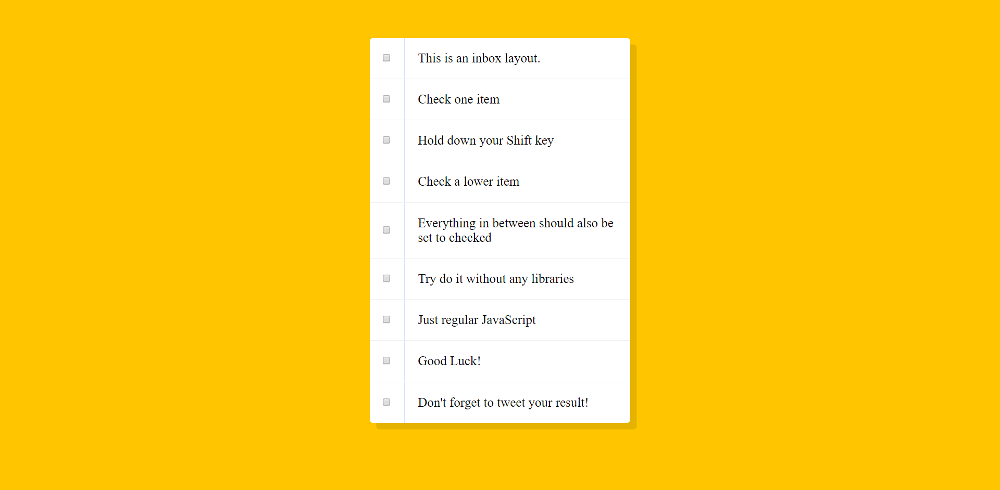
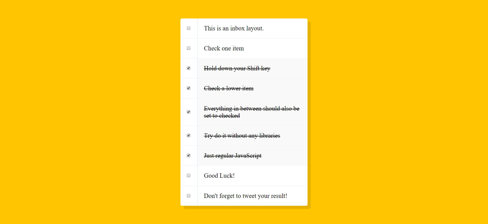

# Check-checkboxes
This is a small mini project where you can check your list and strike through your text.
 
When you check a checkbox and hold shift to check another checkbox.
 
The layout is really simple focusing on it being basic but still have a good design.
 
 

 
 
Using JavaScript you can check if the user has checked any checkbox and also hold the shiftKey.
 
 

